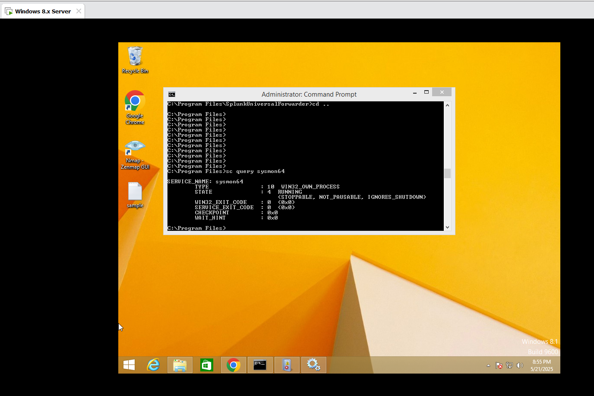

## 🚀 Lab Environment Overview

* **Target Machine**: Windows 8 VM
* **Attacker Machine**: Kali Linux VM
* **SIEM/Log Collector**: Splunk Free running on Host
* **Log Forwarding Tool**: Splunk Universal Forwarder
* **Monitoring Tool**: Sysmon

---

## 📅 Step 1: Setting Up Virtual Machines

### ✅ Install VMware Workstation (or any hypervisor):

1. Download and install VMware Workstation Player (free for personal use).
2. Create two virtual machines:

   * **Windows 8 VM**: Install Windows 8 ISO and complete the setup.
   * **Kali Linux VM**: Download and install the latest Kali ISO from the official site.

### ⚖️ Network Configuration:

* Use **NAT or Bridged** mode so that all VMs can communicate with each other and the host.

## Lab Setup Screenshot :


---

## 🌍 Step 2: Setting Up the SIEM (Splunk on Host)

### 🔧 Install Splunk Free:

1. Download Splunk from [https://www.splunk.com](https://www.splunk.com)
2. Install using default settings.
3. Launch Splunk from the browser at `http://localhost:8000`
4. Create an admin account when prompted.

## Splunk running on Host machine :


---

## 🚪 Step 3: Configuring the Windows 8 Target VM

### 🔢 Install Sysmon:

1. Download Sysmon from Sysinternals: [https://learn.microsoft.com/en-us/sysinternals/downloads/sysmon](https://learn.microsoft.com/en-us/sysinternals/downloads/sysmon)
2. Extract Sysmon and open Command Prompt as Administrator.
3. Run:

   ```bash
   Sysmon64.exe -accepteula -i sysmonconfig-export.xml
   ```

   *(Make sure you have a Sysmon config file. You can use SwiftOnSecurity's config or generate your own.)*
4. Confirm Sysmon service is running:

   ```bash
   sc query sysmon64
   ```
## Sysmon is running :


### 🛠️ Enable Event Logs:

Check that these logs are enabled via Event Viewer:

* Security
* System
* Application
* Windows PowerShell
* Sysmon (click **win + R --> Type eventvwr.exe > under Applications and Services Logs > Microsoft > Windows > Sysmon > Operational**)

## Sysmon logs from event viewer :


---

## 💡 Step 4: Install Splunk Universal Forwarder on Windows 8

1. Download the Universal Forwarder from Splunk: [https://www.splunk.com/en\_us/download/universal-forwarder.html](https://www.splunk.com/en_us/download/universal-forwarder.html)
2. Install with admin privileges.
3. During setup:

   * When prompted for "Receiver Indexer", enter:
   * IP Address: 192.168.29.89   (splunk Host IP)
   * Port: 9997

4. After installation, confirm that Splunk UF service is running:

   ```bash
   services.msc
   ```


5. On Splunk UI(host machine), enable data input:

   * Go to **Settings > Forwarding and Receiving > Configure receiving > Add new port 9997**

 

6. Add **Input.conf** file to the Forwarder to Collect Logs :

   * Option A: Local Config on the Forwarder (Simplest)

   * Edit (or create) this file on the Win8 VM:

#### Path:
  ```bash
  C:\Program Files\SplunkUniversalForwarder\etc\system\local\inputs.conf
  ```
  #### copy this content in inputs.conf file
   ```bash
   [WinEventLog://Application]
   disabled = 0
   index = main

   [WinEventLog://System]
   disabled = 0
   index = main

   [WinEventLog://Security]
   disabled = 0
   index = main

   [monitor://C:\Windows\System32\LogFiles]
   disabled = 0
   index = main

   ```

7. **Restart splunk**:   
#### Path:
  ```bash
  C:\Program Files\SplunkUniversalForwarder\bin
  ```
  ```bash
  splunk restart
  ```
  

---

## 📊 Step 5: Confirming Log Ingestion in Splunk

1. In the Splunk Search app, set time frame to **last 15 minutes** to view recent logs, run:

   ```spl
   index=main host="WIN-BSKF7AVFT5R"
   ```
2. You should see logs coming in from Sysmon and Event Logs.
 

3. Set time frame to **All time** to view All logs (Total - 5,305 event logs).....we can see all source types also  :
 

---

## 📚 Conclusion

You we have a functioning SOC lab with:

* A monitored Windows target system
* Sysmon tracking critical activity
* Logs forwarded to Splunk in real time
* Ready environment for attack simulation and detection development


