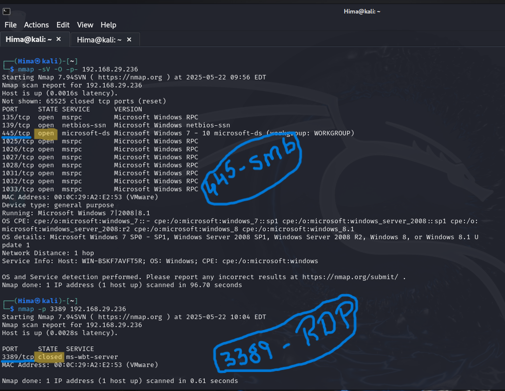
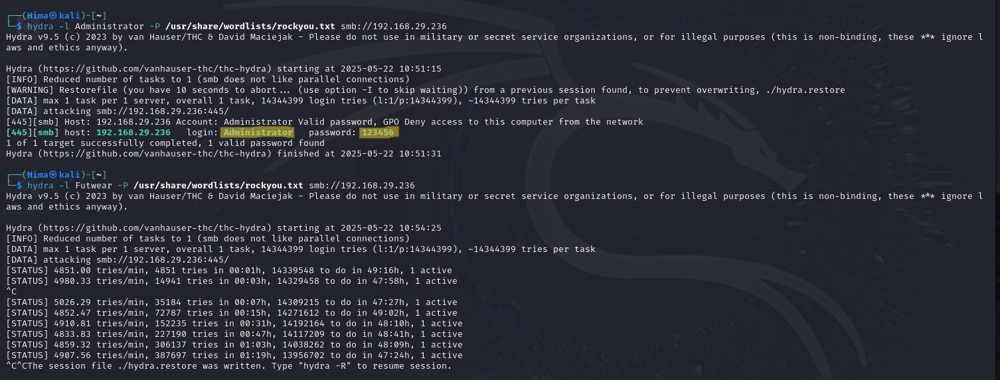
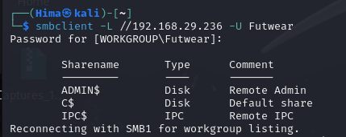
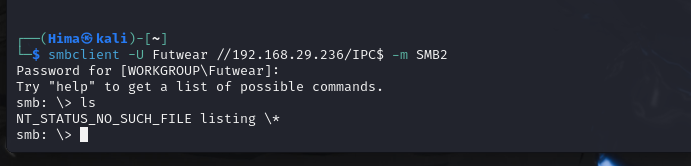
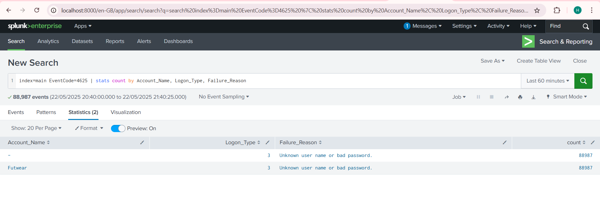
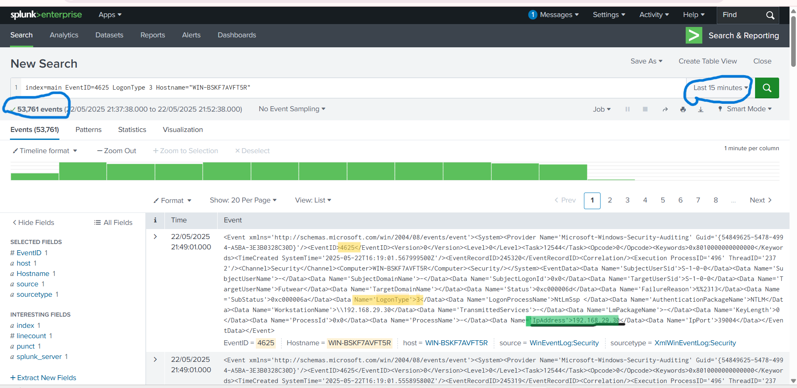
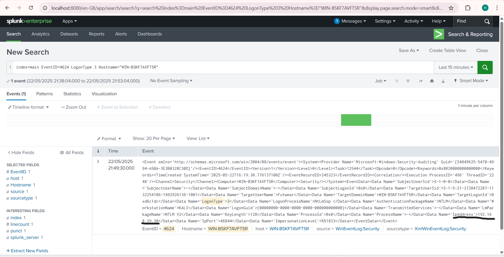
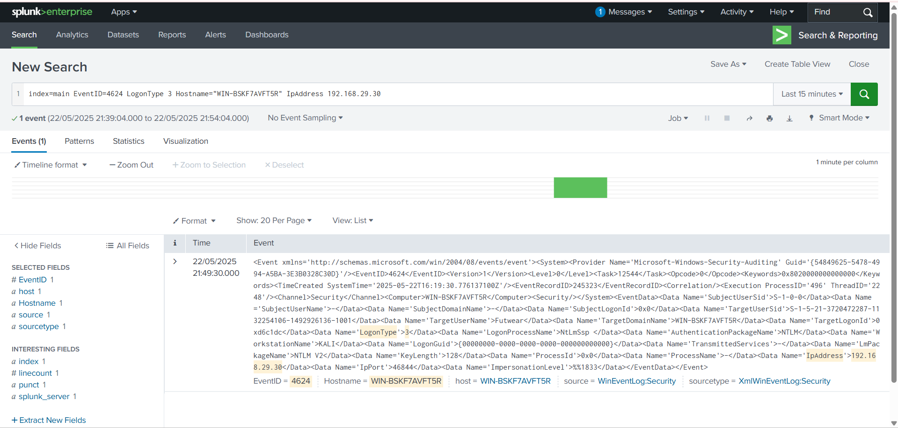

# Brute Force Detection (Windows 8 + Splunk)

This lab simulates a brute-force attack on a Windows 8.1 VM using the SMB protocol and detects it using Splunk. It follows MITRE ATT&CK techniques:
- T1110: Brute Force
- T1078: Valid Accounts

---

## 🛠️ Lab Setup

### Machines
- **Attacker**: Kali Linux (Hydra, smbclient)
- **Victim**: Windows 8.1 (Build 9600) with:
  - Sysmon
  - Splunk Universal Forwarder
- **SIEM**: Splunk Enterprise (host machine)

### Tools Used
- `hydra`: for brute-force attack
- `smbclient`: for SMB access attempts
- `Sysmon`: for process and network monitoring
- `Splunk`: for log ingestion and analysis

---

## 🧪 Attack Steps

### 1. Scan the target for open ports (RDP/SMB) (Kali)
```bash
nmap -sV -O -p- 192.168.29.236
```
 

### 2. SMB Brute Force via Hydra (Kali)
```bash
hydra -l Administrator -P /usr/share/wordlists/rockyou.txt smb://192.168.29.236
```
or 
```bash
hydra -l Futwear -P /usr/share/wordlists/rockyou.txt smb://192.168.29.236 
```
 

### 3. Login to smb with valid credentials (Kali)
**checks available shares**
```bash
smbclient -L //192.168.29.236 -U Futwear
```

 

**To access and login to the smb shares**
```bash
smbclient -U Futwear //192.168.29.236/IPC$ -m SMB2
```
 

### 4. Investigate in Splunk

**Event code - 4625 : Failed logon**
**Event code - 4624 : Successfull logon**

Set the time frame to **last 15 mins / last 60 mins:**
   ```spl
   index=main EventCode=4625 | stats count by Account_Name, Logon_Type, Failure_Reason
   ```



### 🔐 Logon Type Interpretation

| Logon Type | Meaning                  | Brute-force Likely? |
|------------|--------------------------|----------------------|
| 2          | Interactive (local login) | ❌ No (local)         |
| 3          | Network (SMB, remote share) | ✅ Yes               |
| 10         | RemoteInteractive (RDP)  | ✅ Yes                |
| 7          | Unlock                   | ❌ No                 |

> 📌 **Tip**: If you see many Logon Type `3` or `10` failures, that's a clear sign of a brute-force attack.

```spl
   index=main EventID=4625 LogonType 3 hostname="WIN-BSKF7AVFT5R"
```


```spl
   index=main EventID=4624 LogonType 3 hostname="WIN-BSKF7AVFT5R"
```



**Investigation in Splunk:**

* Many failed login events (4625) (logon-type = 3): 53,761
* Time frame : less than 15 min
* The origin IPAddress is same : 192.168.29.30
* we can also observe there is less time gap between last bruteforce attempt (timestamp - 22/05/2025 21.49.01.000) and succesfull login (event id  - 4624)(timestamp - 22/05/2025 21.49.30.000) from the same IP address


**Other ways of spl queries to detect bruteforce attacks: **
* Failed Logins (Event ID 4625)
   ```spl
    index=wineventlog EventCode=4625 IpAddress!="-" IpAddress!=""
    stats count by IpAddress, Account_Name
    where count > 5
    sort - count
   ```

* Successful Login After Brute Force (Event ID 4624)
   ```spl
   index=wineventlog EventCode=4624 IpAddress!="-" IpAddress!=""
   stats count by IpAddress, Account_Name
   ```